---
title: "_"
subtitle: ""
author: "_"
date: ""
format:
  revealjs:
    theme: default
    slide-number: true
    preview-links: auto
    css: custom.css
    chalkboard:
        chalk-effect: 0.0
title-slide-attributes:
  data-background-image: figs/title2.png
  data-background-size: contain
  data-background-opacity: "1.0"
---

## Conclusions

::: {.incremental}
- Zarr is a great choice for storing large bio-imaging data because:
    - efficiently load subsets of your input image
    - write subsets of your output image in parallel
    - store and share (stream) your data easily from the cloud

- Use OME-Zarr for metadata
    - Many software tools support it
    - Be a good digital citizen
:::
---

## Monolithic formats vs Zarr

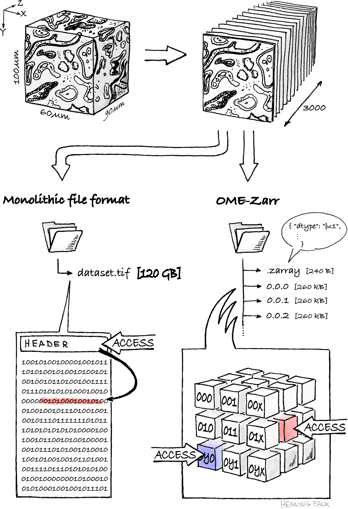{width="30%"}

::: {.image-credit}
Image: “Monolithic vs. chunked” Henning Falk ©2022 NumFOCUS (CC BY 4.0 license)
:::

---

## FAIR

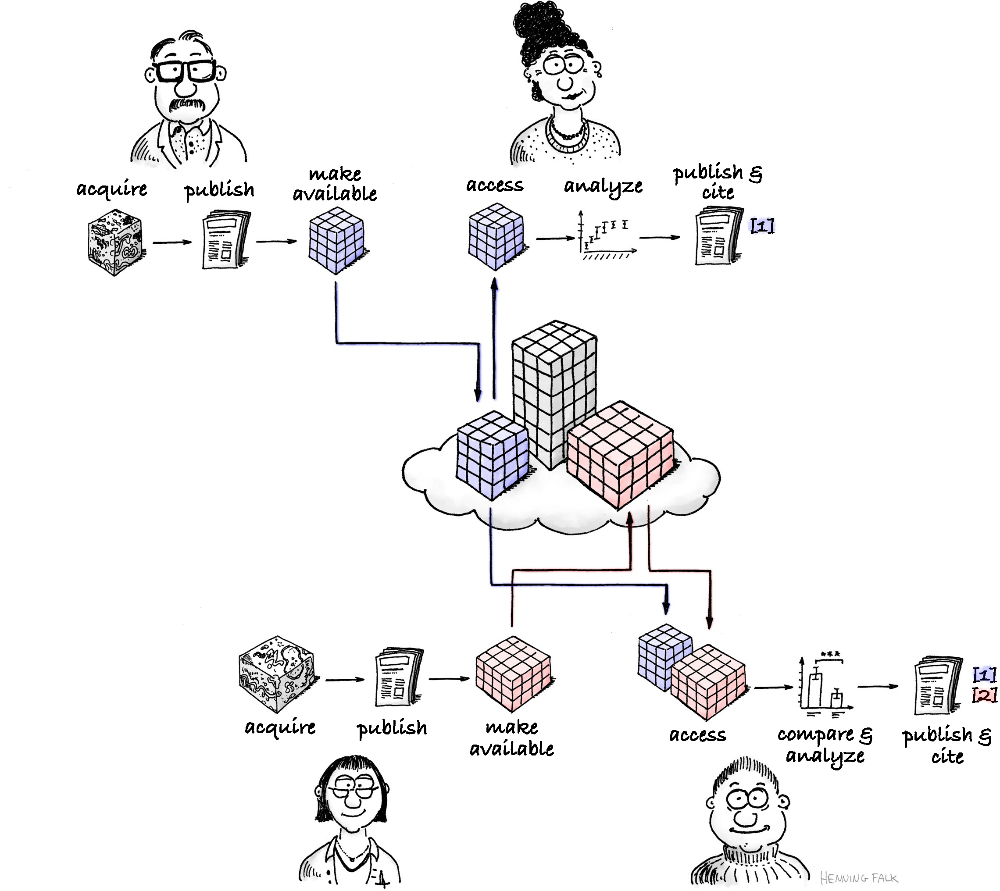

::: {.image-credit}
Image: “FAIR re-use” Henning Falk ©2022 NumFOCUS (CC BY 4.0 license)
:::

---

## Zarr will not solve all your problems

::: {.incremental}
- Zarr lets you make bad decisions, 
    - let's learn to avoid some of them today
- Zarr makes it harder to share (download) your data
- Zarr has limited compression options
    - all lossless
    - converting to zarr may result in an increase in storage cost
:::
---

## Plan

- What is Zarr?
- Why Zarr for ML?
- What is OME-Zarr?
- Simple code examples
- Zarr details
    - Compare zarr to traditional monolithic formats
- Avoid pitfalls
- Others?

# {background-image="./figs/zarr/zarr-logo/zarr-pink-horizontal.svg"
    background-size="contain" 
    background-position=top}

::: {style="margin-top: 45%"}
A Hierarchical, Chunked, Compressed, cloud-native storage format for N-dimensional arrays
:::
---

## Array

Multi-dimensional arrays 

# Compressed {background-image="./figs/art/GoldsmithPress_crop.jpeg" background-opacity=0.7}

## Compression

- Compress your data
    - default is probably fine (blosc-zlib)
    - optimize to your data if you really need it [(Benchmarks)](https://heftieproject.github.io/zarr-benchmarks/)
- Data (generally) need to be completely decompressed to access parts of it.

## Cloud-native {background-image="./figs/art/Waterpipes.jpeg" background-opacity=0.3}

Zarr is a data storage specification more than a *file* format.

::: {.image-credit}
Image: “Waterpipes” Hephaestos ©2004 NumFOCUS (CC BY 3.0 license)
:::

## Hierarchical 

Zarr contains *groups* and *arrays*.

- **Group**: "A folder containing other folders"

- **Array**: "A folder containing data"

Store related Zarr arrays in a meaningful Zarr group.

## A Zarr v2 hierarchy

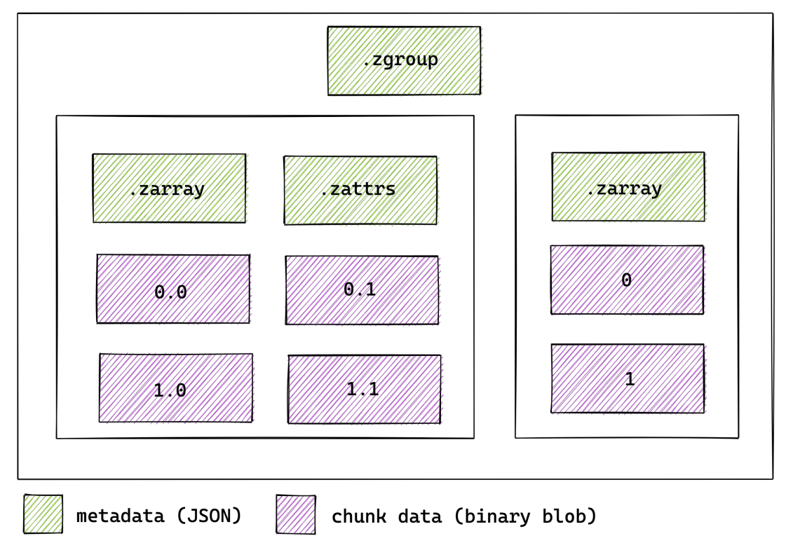

## A Zarr v3 hierarchy

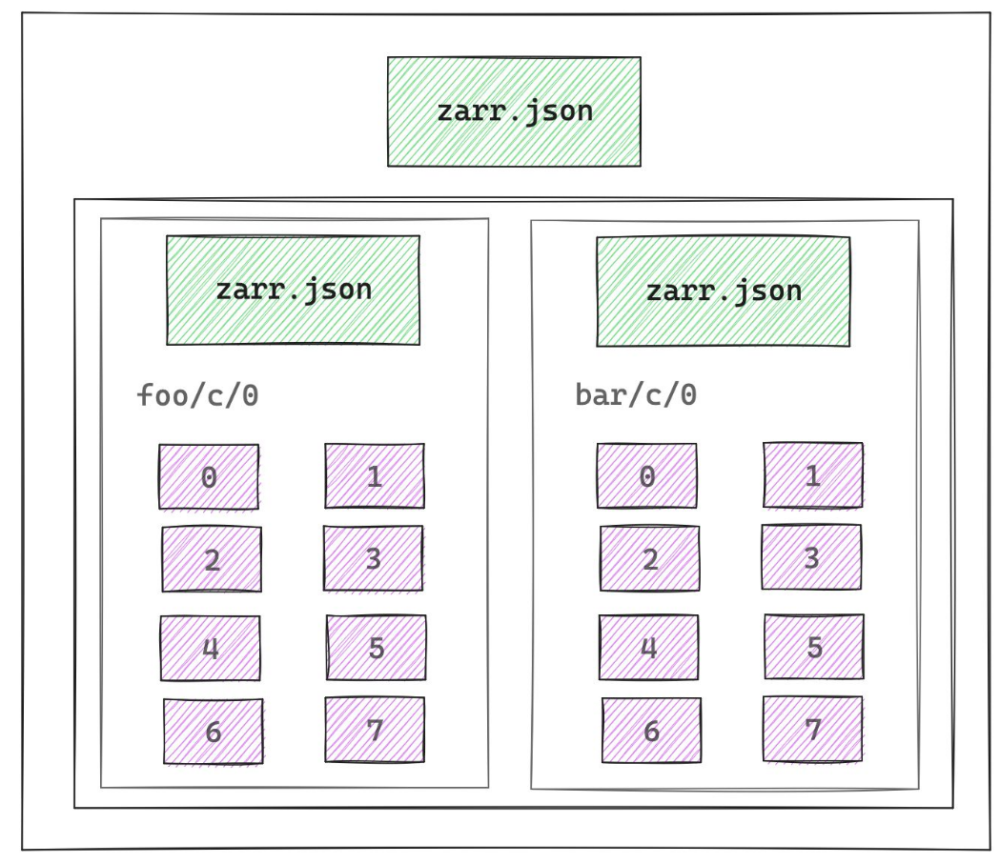

# Chunked {background-image="./figs/art/Space_Invader_2007_Shoreditch.jpg" background-opacity=0.7}

## Chunks

the subset of the array that can be independently accessed.

- Each chunk is compressed separately.
- To read a particular region of interest (ROI), need to read *every chunk that overlaps with that ROI*.

## Example: sliced chunking

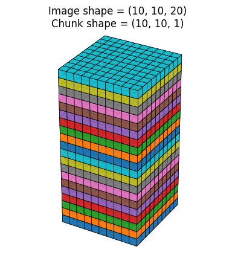
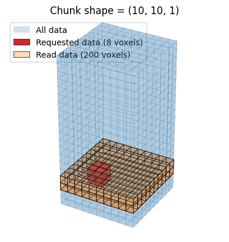

## Example: rectangular chunking

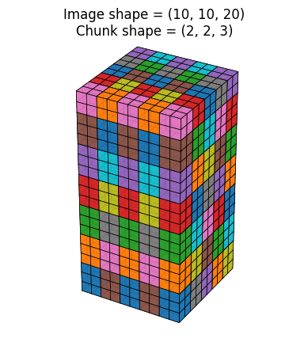
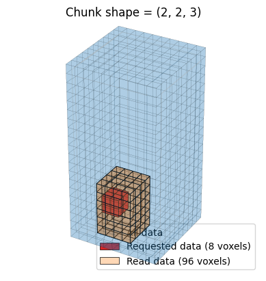

## Good chunk shapes

- Definitely consider how you will access the data
- About 1MB in size
- "Approximately square"
    - considering spatial resolution
- Probably use chunk size `1` or `<size>` for small dimensions (size <~ 10`) 

## Customize chunk size for your access

[Demo](http://localhost:8080/)

# Zarr v3

## Zarr v3 vs Zarr v2

- All metadata goes in `zarr.json`
    - instead of Zarr2's `.zgroup`, `.zarray`, `.zattrs`
- Mostly details
- One big new feature...

# Shards {background-image="./figs/xzibit.jpg" background-opacity=0.6}

"Yo dawg, I heard you like chunks..."

[*"...so I put chunks in your chunks, so you can chunk while you chunk"*]{style="font-size: 0.55em;"}

## What is a shard?

A chunk, with chunks in it.

:::: {.columns}

::: {.column width="50%"}
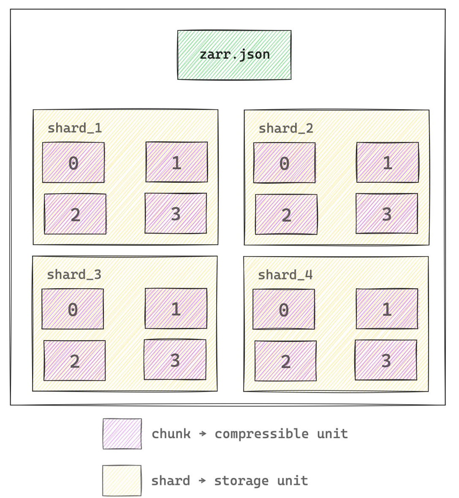
:::

::: {.column width="50%"}
- *read* inner chunks in parallel
- *write* outer shards in parallel
:::

::::

---

## Images

Images are multi-dimensional arrays.
How are they stored?

## Hands on

Live demo

# Metadata {background-image="./figs/art/Ouroboros_Canberra.jpeg" background-opacity=0.7}

## OME-Zarr

An OME-Zarr is a file format optimized for storing, viewing, & sharing large images. There are two parts to an OME-Zarr:

- “Zarr” describes how the images' pixel data are laid out
 - “OME”, (Open Microscopy Environment) describes metadata such as:
    - spatial relationships
    - high content screening data
    - well data
    - and more!

## Jargon

NGFF: "next-generation file format" the community-driven process for designing the next generation
of bioimaging formats.

OME-Zarr: the implementation of those decisions 

## Multiscales

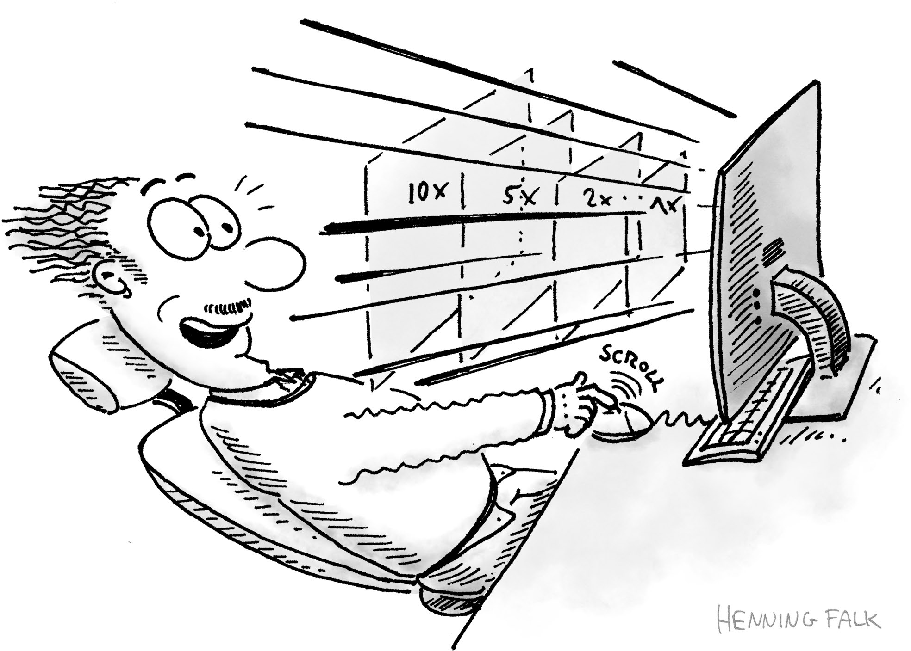

## Multiscales

:::: {.columns}

::: {.column width="40%"}
Use lower resolution levels for
visualization and analysis.
:::

::: {.column width="60%"}
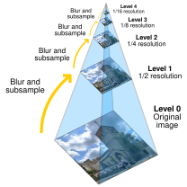
:::

::::

## Software

* [zarr-python]()
* [tensorstore]()
* [ome-zarr-py](https://ome-zarr.readthedocs.io/)
* [ngff-zarr](https://ngff-zarr.readthedocs.io/en/latest/)
* [n5-ij](https://github.com/saalfeldlab/n5-ij#n5-ij-)

## General Resources

* [Zarr specifications](https://zarr-specs.readthedocs.io/en/latest/specs.html)
* [An Introduction to OME-Zarr for Big BioImaging Data](https://ome-zarr-book.readthedocs.io/)
* [OME-Zarr resources](https://ngff.openmicroscopy.org/resources/index.html)
* [Image Data Resource](https://idr.openmicroscopy.org)
* [image.sc forum](https://forum.image.sc/)

## Videos

[OME-Zarr: A next generation file format for FAIR bioimaging data with Chris Barnes.](https://youtu.be/HsqH6RAcJps?si=7FZYrumNiPJEXOXA)

